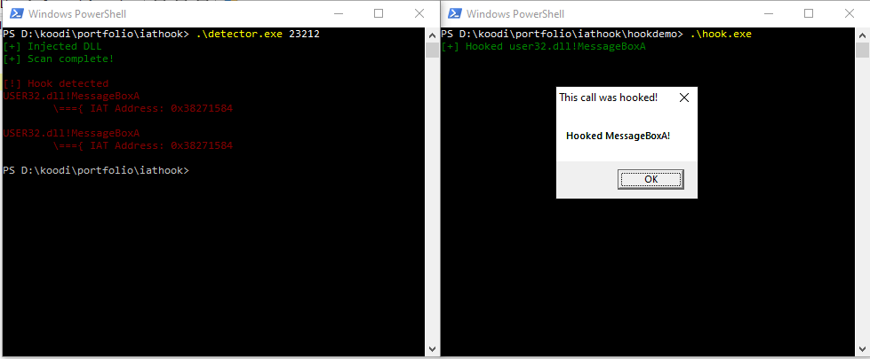

# IAT Hook
IAT hooking is a technique commonly used by both, security products and malware. The idea is basically this: when a program calls an imported function, it will go to the IAT and jump to the address connected to the functions name.
If we are able to change this address, we can redirect execution. When the function A is called, it will actually jump to function B's code.

In this project I included a simple IAT hooking demonstration. It will parse the PE headers to find the IAT and then go through the imported functions until target is found, then overwriting the address with a different function's address.
For demonstration purposes the hooked function just replaces MessageBoxA arguments, but it could be anything.

# IAT Hook detector

⚠️This is still in early development, so false positives are possible, there have been some issues with proxied imports and exports.

Also unfortunately currently this can only be done once for the process, as the DLL injection won't work when it's already loaded.
Later I will make it unload itself automatically.

## How it works?
My initial idea for detection revolved around the fact KnownDLLs have the same address across processes.
So you could compare the KnownDLL IAT addresses of two processes to see if they differed.
However then a little bit later I realized you could simply compare IAT and EAT addresses, which seemed like an overall better approach.

It will go through all modules of a process, looping through every function, then comparing the address to that found in the [EAT](../BACKGROUND.md).
I realized I would need to remotely walk the PEB and have IAT and EAT parsing functions for a remote process, which seemed
like a major headache, so I decided to instead make a program that scans it's own memory, and then inject this into the target with simple DLL injection.

This project consists of: shared memory IPC with events(to get the results), [PEB walk and PE parsing](../parser/README.md), going through the IAT, [going through the EAT](../parser/README.md) and DLL injection.

I was having trouble with proxied imports and exports, causing crashes and false positives.
In IAT-EAT comparison I had to use GetProcAddress to take care of them, however later on I'm going to add support for proxied exports in my own implementation of GetProcAddress.

## Bypassing detection
This kind of detection could be bypassed by hooking both the IAT and the EAT of the target function.

## How to use?
You can build it from source with gcc (or another compiler)
(it has to be named **detector.dll** because this is hardcoded in the logic..)
`gcc hookdetector.c -shared -o detector.dll`
`gcc main.c -o detector.exe`
Then to use it:
`./detector.exe [the process PID to scan]`
Or if you only want to get the function addresses of a given process:
`./detector.exe [the process PID to scan] -a`
This will write function addresses to file

