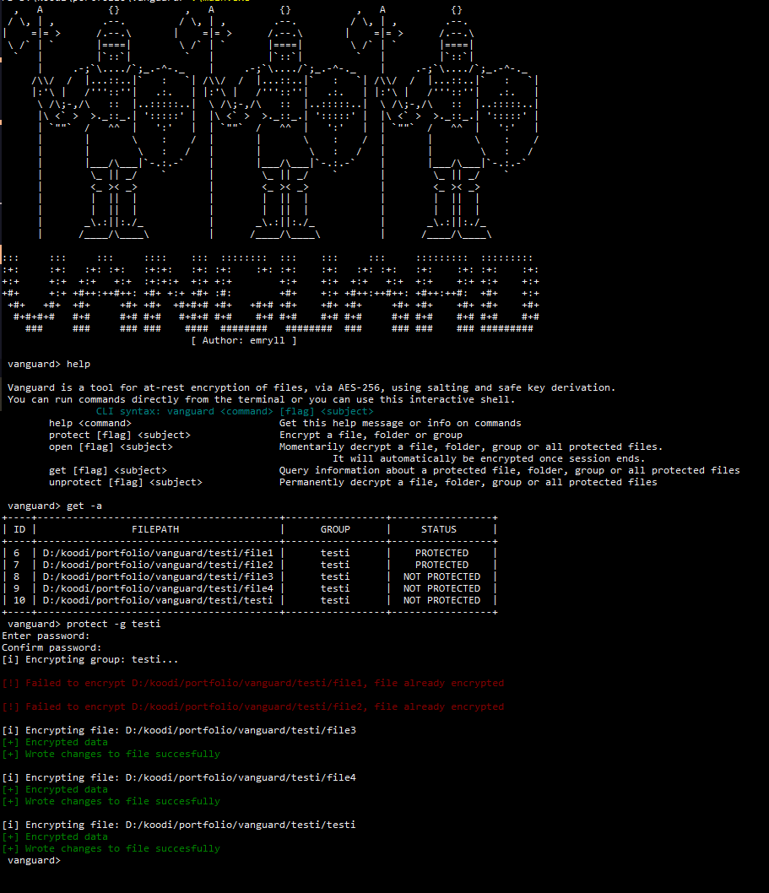

# Vanguard - a CLI at-rest encryption tool
## Platform compatibility
*Unfortunately currently vanguard only works on **Windows only** but it will become cross-platform very soon.*

## Features
- 256-bit AES-GCM encryption with salting.
- Safe key derivation from password with PBKDF2.
- CLI commands and an interactive shell.
- Local database to keep track of protected files.
- (upcoming) session timer process to automatically re-encrypt files after use.



## How to use
You can find a ready-to-use compiled binary in the **bin/** folder, or you can compile from source yourself.

Vanguard can be used directly from the terminal or through an interactive shell.
The format of a vanguard command is like this:

```<command> [flag] <subject>```

For example to move a file into protection:

```protect C:/filepath/file```

...or a folder:

```protect -f C:/folderpath/```

With direct commands you add vanguard infront of it.

There are 4 main commands:
- **protect:** Move a file into protection. (encrypt and add to database)
- **open:** Temporarily decrypt a file. (decrypt file and change state in database)
    (once I implement sessions, this will launch a session)
- **unprotect:** Move a file out of protection. (decrypt and remove from database)
- **get:** Query files from the database.

## Why?
I got the idea for this project while setting up a new laptop. I was thinking about the security setup and I realized I should have a tool to encrypt important files, where they would be encrypted in the normal state.